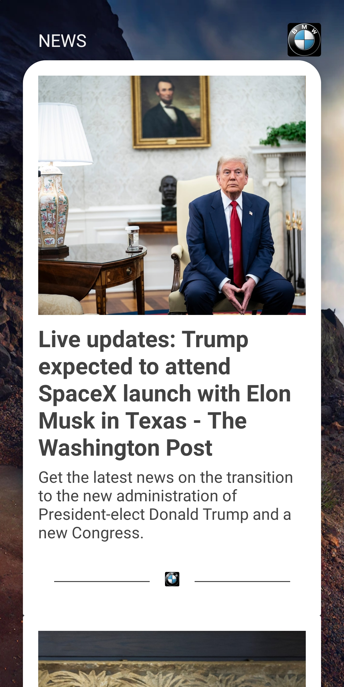
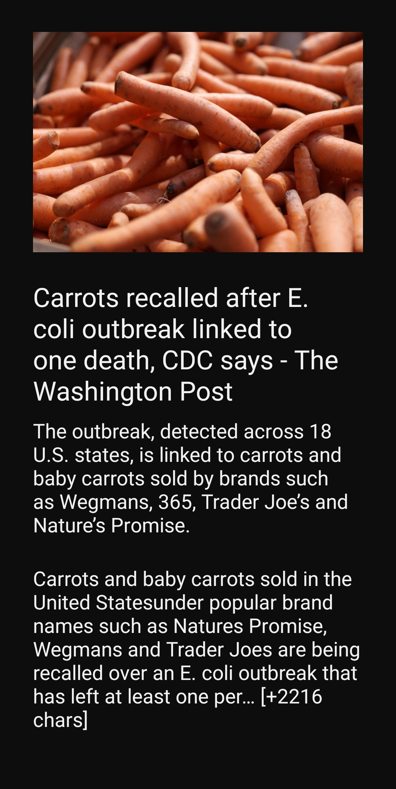

#   News App
News App is an **Android App** focused on helping people to easily **find latest news from United States of America (USA)**

The app allows you to **see a list of the top headlines of the day, and read as many articles as you wish**.

💻Technology:  

* Android;
* Kotlin;
* Android SDK;
* Dependency Injection (Hilt);
* Clean Architecture + MVVM + Modularization + Feature Oriented;
  Architecture sugested and used by Google (https://www.youtube.com/watch?v=16SwTvzDO0A&t=0s)
* Livedata;
* Data Binding;
* Retrofit;
* API REST;
* JSON and Gson;
* Material Design;
* CardView;
* RecyclerView;
* Personalized design patterns created from Material Design;
* Personalized themes (default and dark);
* UI/UX Concepts;
* XML & Constraintlayout;
* Gradle (kts);
* Libs version control using toml;
* JUnit, Espresso and Mockhito libs for tests (Unit, UI and Integration Tests).

🛠️Tools:

* Git/Github;
* Android Studio Lady Bugy 2024.2.1 Patch 2;
* Android smartphone.

⏱️Agile Methodology:
* Kanban.

### Status: Completed.

## Screens

  
  

-------------------------------------------------------------------------------------------------------------------------------------------

# Future Steps
* New Flavor;
* Fingerprint identification;
* Dependency Injection ✅

